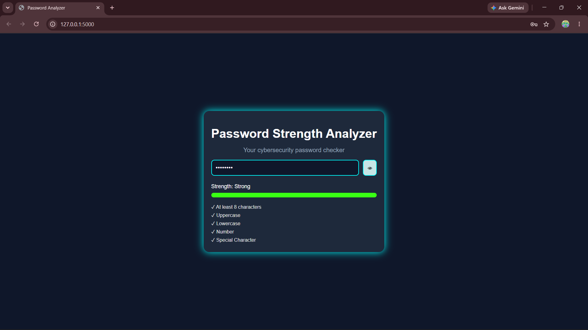

# Password Strength Analyzer

A modern cybersecurity-themed Password Strength Analyzer built using Flask, HTML, CSS, and JavaScript.

## Project Description

Passwords are one of the most important parts of online security, but many users still create weak passwords without realizing it. This project helps users understand how strong their passwords are by providing real-time feedback as they type.

The application checks whether a password contains important security requirements such as sufficient length, uppercase letters, lowercase letters, numbers, and special characters. Based on these checks, it calculates a strength score and displays the result using a dynamic strength meter and visual indicators.

The goal of this project was to learn web development fundamentals while building a practical cybersecurity-related application that demonstrates frontend development, JavaScript logic, Flask integration, and user interface design.

## Features

* Real-time password strength analysis
* Minimum length validation
* Uppercase letter detection
* Lowercase letter detection
* Number detection
* Special character detection
* Dynamic password strength meter
* Weak / Medium / Strong classification
* Show / Hide password functionality
* Responsive dark-themed user interface
* Smooth animations and transitions
* Instant client-side validation

## Preview



## Technologies Used

### Frontend

* HTML5
* CSS3
* JavaScript

### Backend

* Python
* Flask

## Project Structure

```text
password-analyzer/
│
├── app.py
├── requirements.txt
│
├── static/
│   ├── style.css
│   └── script.js
│
└── templates/
    └── index.html
```

## How It Works

1. The user enters a password.
2. JavaScript listens for input in real time.
3. The password is checked against multiple security requirements:

   * Length
   * Uppercase letters
   * Lowercase letters
   * Numbers
   * Special characters
4. A score is calculated based on the requirements met.
5. The application updates:

   * Requirement checklist
   * Strength text
   * Strength meter
   * Visual indicators
6. Users can toggle password visibility using the eye icon.

## Installation

### Clone the Repository

```bash
git clone https://github.com/jay-alvala/password-strength-analyzer.git
```

### Navigate to the Project

```bash
cd password-strength-analyzer
```

### Create a Virtual Environment

```bash
python -m venv venv
```

### Activate the Virtual Environment

Windows:

```bash
venv\Scripts\activate
```

### Install Dependencies

```bash
pip install -r requirements.txt
```

### Run the Application

```bash
python app.py
```

### Open in Browser

```text
http://127.0.0.1:5000
```

## What I Learned

Through this project I learned:

* HTML page structure
* CSS styling and layout design
* Flexbox
* JavaScript DOM manipulation
* Event listeners
* Regular expressions (Regex)
* Dynamic UI updates
* Functions and code refactoring
* Client-side validation
* Flask fundamentals
* Git and GitHub workflow

One of the biggest lessons from this project was learning how to refactor repeated code into reusable functions, making the code cleaner and easier to maintain.

## Future Improvements

* Password generator
* Password breach checking
* Accessibility improvements
* Advanced password scoring
* Password history analysis
* Dark/Light theme switch

## Author

**Jay Alvala**

Cybersecurity Student | Aspiring Security Professional | Web Development Learner
